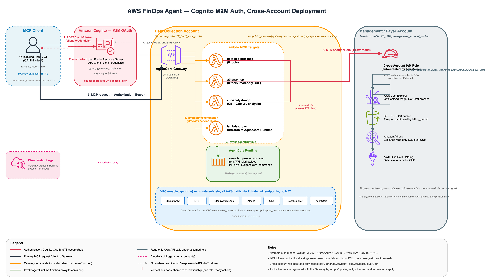

# AWS FinOps Agent

[](LICENSE)
[](pyproject.toml)
[](terraform/versions.tf)
[](https://github.com/astral-sh/ruff)
[](https://github.com/astral-sh/uv)
[](https://docs.ragas.io/)

An MCP (Model Context Protocol)-enabled agent for Cloud Financial Management (CFM) that provides secure access to AWS Cost Explorer, Amazon Athena CUR 2.0, and AWS APIs. Deploys on Amazon Bedrock AgentCore with AWS Lambda functions and integrates with MCP clients like QuickSuite and Claude Code.

## Architecture



All Gateway targets are **Lambda functions**. The `lambda-proxy` Lambda forwards requests to the Bedrock AgentCore Runtime which hosts the aws-api-mcp-server container.

## Deployment Modes

The gateway supports two deployment modes, configured via `terraform/config/.env`:

- **Cross-account** (recommended): Gateway + CUR bucket + Glue catalog live in the **data collection account**. The management/payer account is consulted **only** by `cost-explorer-mcp` for org-wide Cost Explorer (a payer-only API). Set both `TF_VAR_aws_profile` (data collection) and `TF_VAR_management_account_profile` (payer).
- **Single-account**: Everything in one account. Set `AWS_PROFILE` only. Suitable for standalone accounts or testing.

Cross-account mode follows the [AWS recommended approach](https://docs.aws.amazon.com/organizations/latest/userguide/orgs_best-practices_mgmt-acct.html) of keeping workloads out of the management account. It matches the [AWS Cloud Intelligence Dashboards](https://docs.aws.amazon.com/guidance/latest/cloud-intelligence-dashboards/cudos-cid-kpi.html) (CUDOS, CID, KPI) topology, where CUR Parquet is S3-replicated from the payer into the data collection account and the Glue catalog lives locally there:

```
   Data Collection Account                Management / Payer Account
  ┌──────────────────────────┐           ┌──────────────────────────┐
  │ CUDOS / CID / KPI        │           │ Upstream BCM CUR 2.0     │
  │ Dashboards               │           │ export (provisioned by   │
  │                          │           │ CID / aws-finops-infra)  │
  │ AWS FinOps Agent         │           │                          │
  │  ├ athena-mcp ───┐       │           │ Cost Explorer API        │
  │  └ cur-analyst ──┤ local │           │ (org-wide, payer-only)   │
  │                  ▼       │           │                          │
  │ CUR S3 bucket            │◄──────────┤ S3 cross-account          │
  │ Glue: cid_data_export    │ replication                          │
  │                          │           │                          │
  │  └ cost-explorer-mcp ────┼──────────►│ IAM Role (auto-created)  │
  │                          │ AssumeRole│                          │
  └──────────────────────────┘           └──────────────────────────┘
```

Two distinct cross-account flows, each on its own row:
- **S3 replication** (payer → data collection): upstream, provisioned by CID / [aws-finops-infra](https://github.com/aws-samples/aws-finops-infra), **not** by this repo.
- **AssumeRole** (data collection → payer): only `cost-explorer-mcp` uses it. `athena-mcp` and `cur-analyst-mcp` query the local Glue catalog directly via the Lambda execution role — no STS hop.

A single `make deploy` creates resources in both accounts. Terraform auto-generates an [External ID](https://docs.aws.amazon.com/IAM/latest/UserGuide/id_roles_create_for-user_externalid.html) to secure the assumed role (stored in Terraform state).

## Prerequisites

1. **AWS Marketplace Subscription** - [Subscribe to aws-api-mcp-server](https://aws.amazon.com/marketplace/pp/prodview-lqqkwbcraxsgw) (free, accept terms). For cross-account deployments, subscribe from the **data collection account**.
2. **CUR 2.0 Export** - [Create a Cost and Usage Report 2.0](https://docs.aws.amazon.com/cur/latest/userguide/cur-create.html) export to Amazon S3 with Athena integration enabled. Ensure the S3 bucket has Block Public Access enabled and server-side encryption configured.
3. **Identity Provider (IdP)** — *optional*: only needed if you switch to `gateway_auth_type = "CUSTOM_JWT"`. The default (`COGNITO`) auto-provisions a Cognito User Pool + OAuth client for service-to-service callers (QuickSuite, n8n, CI) — no external IdP required. See [Identity Provider Setup](#identity-provider-setup).
4. **AWS CLI Profiles** - [Named profiles](https://docs.aws.amazon.com/cli/v1/userguide/cli-configure-files.html) configured for target account(s)
5. **Tools** - Terraform >= 1.5.0, [uv](https://docs.astral.sh/uv/), tflint (optional)

## Quick Start

This deploys the AWS FinOps Agent infrastructure:
- AgentCore Gateway with JWT authentication
- AWS Lambda functions (cost-explorer-mcp, athena-mcp, cur-analyst-mcp, lambda-proxy)
- IAM roles and policies (including the management-account role consumed by `cost-explorer-mcp`, if cross-account mode is configured)
- AgentCore Runtime (aws-api-mcp-server container)

**Not included:** QuickSuite requires manual setup after deployment. See [QuickSuite Agent Setup](docs/quicksuite-agent-setup.md).

```bash
# 1. Interactive setup wizard — prompts for every value, validates against AWS
#    (STS/S3/Glue), and writes terraform/config/.env + terraform.tfvars.
make setup

# 2. Initialize and deploy
make init
make deploy   # Runs: apply-auto + update-schemas

# 3. Get gateway endpoint
make output
```

The wizard replaces the old "copy examples and hand-edit" flow. If you'd rather
skip prompts — e.g. in CI or when hand-editing — use `make setup-quick` to copy
the `.example` files verbatim, or drive the wizard with flags:

```bash
# Non-interactive (agent / CI): every answer as a flag, validated same as TTY mode
uv run --with 'questionary>=2.0,boto3' python scripts/setup_wizard.py \
  --non-interactive --yes \
  --project-name finops-mcp --deployment-mode single \
  --aws-profile default --aws-region us-east-1 --auth-mode COGNITO \
  --cur-bucket my-cur-bucket --cur-database cur_database --cur-table cur_daily \
  --environment dev --owner $USER --cost-center ""
```

Run `python scripts/setup_wizard.py --help` for the full flag surface.

## Configuration Files

### terraform/config/.env

Environment variables for the Makefile and Terraform. Generated by `make setup` (or copied from `.env.example` by `make setup-quick`).

**Single-account mode** (gateway and CUR data in same account):

```bash
AWS_PROFILE=default
AWS_REGION=us-east-1
```

**Cross-account mode** (recommended):

```bash
AWS_REGION=us-east-1
AWS_PROFILE=data_collection                    # For Makefile scripts
TF_VAR_aws_profile=data_collection             # Terraform: data collection account
TF_VAR_management_account_profile=root         # Terraform: management/payer account
```

| Variable                            | Description                                                               |
| ----------------------------------- | ------------------------------------------------------------------------- |
| `AWS_PROFILE`                       | AWS CLI profile for Makefile scripts (update-schemas, test-lambdas)       |
| `AWS_REGION`                        | AWS region for deployment                                                 |
| `TF_VAR_aws_profile`                | Terraform provider profile for data collection account                    |
| `TF_VAR_management_account_profile` | Terraform provider profile for management account (enables cross-account) |
| `TF_VAR_n8n_cross_account_id`       | AWS account ID where n8n runs (optional)                                  |

### terraform/config/terraform.tfvars

Terraform variables for project configuration. Generated by `make setup` (or copied from `terraform.tfvars.example` by `make setup-quick`).

**Required: CUR Configuration**

You must configure these variables to match your CUR 2.0 export settings. Find these values in the AWS Cost and Usage Reports console or your Athena/AWS Glue setup:

```hcl
# CUR (Cost and Usage Report) Configuration - REQUIRED
cur_bucket_name            = "your-cur-bucket"      # S3 bucket with CUR 2.0 data
cur_database_name          = "your_cur_database"    # AWS Glue database name (check Athena)
cur_table_name             = "your_cur_table"       # AWS Glue table name (check Athena)
cur_athena_output_location = ""                     # Optional: S3 path for Athena results
                                                    # Defaults to s3://{cur_bucket}/athena-results/
```

> **Important: Verify your Athena table covers all billing periods.** CUR 2.0 exports store data in Hive-style partitioned folders (e.g., `s3://{bucket}/.../data/BILLING_PERIOD=2025-12/`). Some AWS Glue Crawlers set the table location to a specific billing period instead of the parent `data/` directory, which causes Athena to only return that single month. Verify by running:
> ```sql
> SELECT DISTINCT billing_period FROM your_database.your_table ORDER BY billing_period;
> ```
> If only one month appears, update the table location to the parent path:
> ```sql
> ALTER TABLE your_database.your_table SET LOCATION 's3://your-cur-bucket/.../data/';
> ```

**Other settings:**

```hcl
project_name      = "finops-mcp"           # Prefix for all resources (optional)

# VPC: places Lambdas in a VPC with private subnets and 7 VPC endpoints
# (S3, STS, Logs, Athena, AWS Glue, Cost Explorer, Bedrock AgentCore)
# No NAT Gateway needed — all AWS API traffic goes through VPC endpoints
enable_vpc        = true                   # Default: false
# vpc_cidr        = "10.0.0.0/24"         # Default: "10.0.0.0/24"

# Lambda concurrency and log retention
# lambda_reserved_concurrent_executions = 10   # Default: 10
# log_retention_in_days                 = 365  # Default: 365
```

See [Configuration](docs/configuration.md) for all options.

## Identity Provider Setup

AgentCore Gateway supports four authentication modes: `COGNITO` (default — auto-provisioned M2M), `CUSTOM_JWT` (BYO OIDC IdP for user auth), `AWS_IAM` (SigV4), or `NONE`. The default `COGNITO` flow provisions a Cognito User Pool + OAuth client automatically — ideal for service-to-service callers like QuickSuite, n8n, or CI jobs. Switch to `CUSTOM_JWT` if you need human users authenticated via a corporate IdP (Okta, Azure AD, Auth0, etc.).

### Option A: Cognito M2M (default)

Default auth. Nothing to configure — just run:

```bash
make apply
make show-cognito-creds   # prints client_id, client_secret, token_url, scope
make test-jwt             # E2E smoke test: fetch token → call Gateway
```

Paste the printed `client_id` / `client_secret` / `token_url` into QuickSuite's MCP connector. See [docs/auth-cognito.md](docs/auth-cognito.md) for full details, rotation instructions, and troubleshooting.

### Option B: Bring-your-own OIDC IdP (CUSTOM_JWT)

Set `gateway_auth_type = "CUSTOM_JWT"` in `terraform/config/terraform.tfvars` to use this mode.

QuickSuite (or any OAuth-capable MCP client) connects using OAuth credentials from your IdP:

| Field             | Description                                 |
| ----------------- | ------------------------------------------- |
| Client ID         | OAuth application identifier                |
| Client Secret     | OAuth application secret                    |
| Token URL         | Endpoint to exchange credentials for tokens |
| Authorization URL | Endpoint for user authorization             |

#### OIDC Provider Setup

1. Register an OAuth application in your OIDC-compliant identity provider
2. Configure OAuth grant type (e.g., Client Credentials)
3. Note down Client ID, Client Secret, and Discovery URL
4. Update `terraform/config/terraform.tfvars`:
   ```hcl
   gateway_auth_type     = "CUSTOM_JWT"
   jwt_discovery_url     = "https://your-idp.example.com/.well-known/openid-configuration"
   jwt_allowed_audiences = ["your-audience-id"]
   ```

#### Supported Identity Providers

Any OIDC-compliant IdP works. Update `jwt_discovery_url` and `jwt_allowed_audiences` accordingly:

- **Okta**: `https://{domain}.okta.com/.well-known/openid-configuration`
- **Azure AD**: `https://login.microsoftonline.com/{tenant-id}/v2.0/.well-known/openid-configuration`
- **Auth0**: `https://{domain}.auth0.com/.well-known/openid-configuration`

## MCP Client Configuration

After deployment, configure your MCP client (QuickSuite) to connect to the gateway. See [QuickSuite Agent Setup](docs/quicksuite-agent-setup.md) for detailed instructions.

## Available Targets

| Target                         | Description                                       |
| ------------------------------ | ------------------------------------------------- |
| `aws-api-mcp`                  | AWS API MCP server (Marketplace) — `call_aws`, `suggest_aws_commands` |
| `cost-explorer-mcp`            | AWS Cost Explorer API (6 tools)                   |
| `athena-mcp`                   | Athena queries (8 tools)                          |
| `cur-analyst-mcp`              | AWS Cost Explorer + Athena CUR 2.0 (1 tool)       |

## Documentation

| Guide                                                    | Description                                          |
| -------------------------------------------------------- | ---------------------------------------------------- |
| [Security](SECURITY.md)                                  | Security controls, shared responsibility model, IAM design, AI security (scanned with Checkov, Semgrep) |
| [Architecture](docs/architecture.md)                     | Detailed architecture, components, project structure |
| [MCP Tools Reference](docs/mcp-tools-reference.md)       | All 17 MCP tools by target                           |
| [Configuration](docs/configuration.md)                   | tfvars, permissions, make commands                   |
| [Troubleshooting](docs/troubleshooting.md)               | Debugging, logs, common issues                       |
| [n8n Integration](docs/n8n-integration.md)               | Cross-account Lambda for CFM workflows               |
| [QuickSuite Agent Setup](docs/quicksuite-agent-setup.md) | Configure CFM agent in QuickSuite                    |

## Testing

The project includes an agentic evaluation suite built on [RAGAS](https://docs.ragas.io/) that validates MCP tools end-to-end through the AgentCore Gateway with JWT auth. Tests compare tool responses against direct AWS API calls (ground truth) and evaluate tool call correctness, schema quality, and FinOps data accuracy.

### Test Setup

With the default `COGNITO` auth mode, the stack provisions its own OAuth app — no browser round-trip needed:

```bash
# 1. Deploy the stack first
make deploy

# 2. Fetch a Cognito access token (cached to .gateway-token.json)
make get-token
```

The test harness reads `GATEWAY_ID` from terraform output and the token from `.gateway-token.json` automatically. For the legacy CUSTOM_JWT federate-IdP flow, set OAuth env vars (`GATEWAY_CLIENT_ID`, `GATEWAY_CLIENT_SECRET`, `GATEWAY_TOKEN_URL`, `GATEWAY_AUTHORIZE_URL`) in `terraform/config/.env` before running the tests.

### Running Tests

| Command                              | Description                                |
| ------------------------------------ | ------------------------------------------ |
| `make test-evals`                    | RAGAS agentic evals (tool accuracy, F1, schema quality) |
| `make test-ground-truth`             | Differential tests (MCP vs direct API)     |
| `make test-all-evals`                | All tests                                  |
| `make test-all-evals VERBOSE=1`      | All tests with full MCP response output    |

Add `PYTEST_ARGS=` for extra pytest options:

```bash
# Run a single test
make test-evals PYTEST_ARGS="-k test_ce11_today_date"

# Verbose output for ground truth only
make test-ground-truth VERBOSE=1
```

### Test Structure

```
tests/
├── conftest.py                  # Fixtures: gateway client, ground truth client, LLM judge
├── helpers/
│   ├── gateway_client.py        # MCP client → AgentCore Gateway (HTTP + JWT)
│   ├── ground_truth.py          # Direct boto3 calls to Cost Explorer / Athena
│   ├── oauth_token.py           # OAuth2 PKCE flow for JWT token
│   ├── comparators.py           # Differential comparison (MCP vs API response formats)
│   └── finops_metrics.py        # Custom RAGAS metrics (AspectCritic, RubricsScore)
├── scenarios/
│   ├── cost_explorer.py         # 12 eval scenarios (CE-1 to CE-12)
│   └── athena.py                # 8 eval scenarios (ATH-1 to ATH-8)
├── test_tool_call_accuracy.py   # Deterministic: correct tool + args
├── test_tool_call_f1.py         # Precision/recall: flexible tool ordering
├── test_agent_goal.py           # LLM-as-judge: semantic correctness
├── test_finops_quality.py       # Schema correctness: date formats, metrics, group_by
└── test_ground_truth.py         # Differential: MCP result == direct API result
```

### Eval Tiers

1. **Deterministic** — Tool call accuracy and F1 (no LLM needed). Validates correct tool selection, parameter formats, and schema compliance.
2. **LLM-as-judge** — `AgentGoalAccuracy` + custom `AspectCritic` metrics via Bedrock Claude. Evaluates error handling, DDL rejection, and FinOps-specific quality.
3. **Ground truth** — Calls the same query through both MCP Gateway and direct boto3, then compares results. Catches data mismatches, format discrepancies, and cross-account access issues.

## Make Commands

| Command               | Description                                           |
| --------------------- | ----------------------------------------------------- |
| `make setup`              | Interactive wizard — prompts + AWS validation, writes config files    |
| `make setup-quick`        | Copy `.example` configs verbatim (no prompts, no validation)          |
| `make init`               | Initialize Terraform                                                  |
| `make plan`               | Show execution plan (check for drift)                                 |
| `make apply`              | Apply changes (with confirmation)                                     |
| `make deploy`             | Full deploy: `apply-auto` + `update-schemas`                          |
| `make update-schemas`     | Update gateway tool schemas (auto-detects gateway ID)                 |
| `make output`             | Show outputs (gateway endpoint, etc.)                                 |
| `make destroy`            | Destroy all resources                                                 |
| `make show-cognito-creds` | Print Cognito OAuth creds for MCP client setup (COGNITO auth only)    |
| `make get-token`          | Fetch a fresh Cognito access token, cache to `.gateway-token.json`    |
| `make test-jwt`           | End-to-end smoke test: token → Gateway initialize → 200 (COGNITO)     |
| `make test-evals`         | RAGAS agentic evals (tool accuracy, F1, schema quality)               |
| `make test-ground-truth`  | Differential tests (MCP vs direct API)                                |
| `make test-all-evals`     | All evals (add `VERBOSE=1` for full MCP response output)              |

> **Note:** After `make apply`, run `make update-schemas` to update gateway targets with full tool definitions. Or use `make deploy` which does both.

## Cleanup

```bash
make destroy
```
